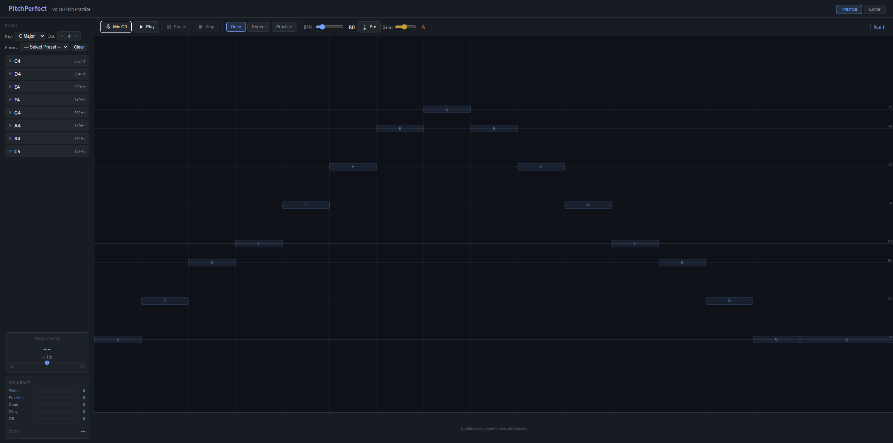

# PitchPerfect

A browser-based voice pitch practice tool. Sing along with customizable melodies, get real-time feedback on your pitch accuracy, and track your progress.

## Preview



## Features

- **Real-time pitch detection** via Web Audio API
- **Practice modes**: Once, Repeat, and cyclic Practice with configurable cycles
- **Piano roll editor** for creating custom melodies
- **Octave control** with up/down arrows (works for presets and default melody)
- **Accuracy scoring**: Perfect, Excellent, Good, Okay, Off
- **Metronome precount** before playback
- **Cents deviation display** showing pitch distance from target

## Usage

Open `public/index.html` in a modern browser.

1. Click **Mic** to enable microphone input
2. Select a **Key** and **Octave** (or choose a preset)
3. Click **Play** to start — sing the notes on the pitch canvas
4. Your pitch is shown in real-time with accuracy tracking per note

### Controls

| Control | Description |
|---------|-------------|
| Mic | Toggle microphone |
| Play/Pause/Stop | Playback transport |
| Once / Repeat / Practice | Playback mode |
| BPM | Tempo (40–280) |
| Pre | Metronome precount |
| Sens | Pitch detection sensitivity |

## Project Structure

```
├── public/           # Static site — deploy this folder to any hosting
│   ├── index.html    # Main HTML
│   ├── app.js        # Application logic
│   ├── audio-engine.js   # Web Audio playback
│   ├── pitch-detector.js # Microphone input & pitch detection
│   ├── piano-roll.js     # Piano roll editor
│   ├── scale-data.js     # Music theory utilities
│   ├── style.css     # Styles
│   └── package.json  # npm scripts for CI
├── .github/          # GitHub Actions CI workflow
├── assets/          # Images and static assets
├── package.json     # Root package (empty)
└── todo.md          # Feature ideas
```

## Deployment

Deploy the `public/` directory as a static site to any hosting provider (e.g. Deno Deploy, GitHub Pages, Netlify, Vercel).

## Requirements

- Modern browser with Web Audio API and `getUserMedia`
- Microphone access for pitch detection
