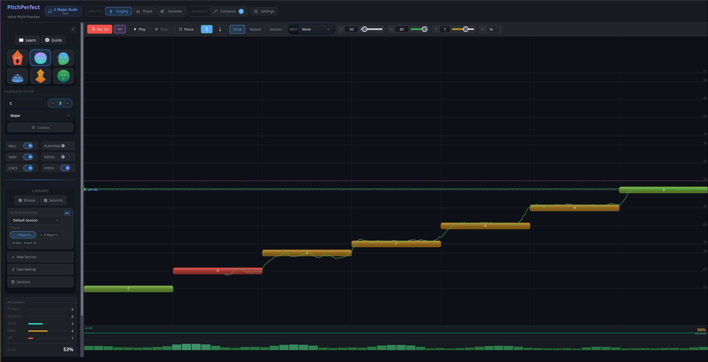
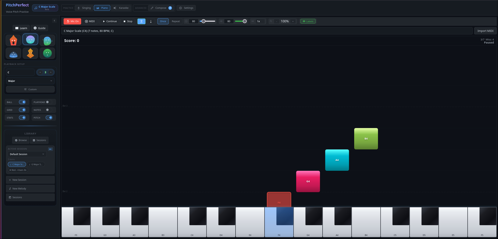

# MercuryPitch

A browser-based vocal pitch practice tool with AI stem separation, community features, and real-time audio processing. Sing along with customizable melodies, get real-time feedback on your pitch accuracy, and track your progress over time.

## Live Demo

Open [mercurypitch.com](https://mercurypitch.com) in a modern browser to try it out.

## Showcase





## Features

### Core Practice

- **Real-time pitch detection** — Web Audio API + YIN algorithm tracks your voice with sub-cent accuracy
- **Practice modes** — Once, Repeat, and cyclic Practice with configurable cycles
- **Piano roll editor** — Click to place notes, drag to move, right-click to delete
- **Scale builder** — Define root note and scale type to generate melodies
- **Focus Mode** — AI-powered practice: app analyzes your history and targets the notes you struggle with
- **Session tracking** — Record practice sessions, see per-note accuracy and cents deviation, review progress over time
- **MIDI import/export** — Load .mid files or share your melody as a URL-encoded preset
- **ADSR envelope** — Shape the Attack/Decay/Sustain/Release of note playback
- **Reverb effects** — Add Room, Hall, or Cathedral reverb to practice playback
- **Metronome precount** — Count-in before playback, optional click track during play
- **Theme support** — Dark and light themes, persisted to localStorage
- **Accuracy bands** — Configure how many cents off counts as Perfect/Excellent/Good/Okay

### UVR Stem Separation

- **AI vocal separation** — Separate any audio file into vocal and instrumental stems using UVR-MDX-NET
- **Multi-stem mixer** — Mix stems with independent volume control and synchronized playback
- **Synced lyrics** — Auto-fetch and display synced (LRC) lyrics during stem playback
- **LRC generator** — Generate timestamped lyrics with block/verse markers
- **Mic pitch scoring** — Sing along with separated vocals and get real-time accuracy scoring
- **Session history** — Browse, replay, and share past separation sessions with 3-column gallery
- **Hash-based deep links** — Shareable URLs for sessions, mixer views, and community content

### Community

- **Vocal challenges** — Take on pitch accuracy challenges and compete on the leaderboard
- **Community sharing** — Share melodies and session results with hash-based URLs
- **Leaderboard** — See top performers and recent activity

### Getting Started

1. Click **Mic** to enable microphone input
2. Select a **Key** and **Octave** (or choose a preset melody)
3. Click **Play** to start — sing the notes shown on the pitch canvas
4. Your pitch is tracked in real-time with per-note accuracy scoring

### Tabs

| Tab            | Description                                                      |
| -------------- | ---------------------------------------------------------------- |
| Singing        | Main pitch practice with piano roll and real-time feedback       |
| Compose        | Piano roll note editor with scale builder and MIDI import/export |
| Analysis       | Visualize vocal recordings and session history                   |
| Karaoke        | AI stem separation — upload audio, mix stems, synced lyrics      |
| Community      | Browse shared melodies and sessions                              |
| Leaderboard    | Top performers across challenges                                 |
| Challenges     | Timed pitch accuracy challenges                                  |
| Jam            | P2P music jam — play together in real-time via WebRTC            |
| Pitch Analysis | Analyze and compare pitch detection algorithms                   |
| Pitch Test     | Test pitch detection with live microphone input                  |
| Settings       | App settings, keyboard shortcuts, theme, about                   |

## Project Structure

```
├── src/
│   ├── App.tsx                    # Main SolidJS application
│   ├── index.tsx                  # Entry point
│   ├── components/                # UI components
│   ├── contexts/                  # SolidJS context providers
│   ├── data/                      # Static data and presets
│   ├── e2e/                       # End-to-end test utilities
│   ├── features/                  # Feature modules (practice, UVR, community)
│   ├── lib/                       # Core business logic and utilities
│   │   ├── audio-engine.ts        # Web Audio playback + ADSR + reverb
│   │   ├── pitch-detector.ts      # YIN pitch detection via microphone
│   │   ├── piano-roll.ts          # Piano roll canvas rendering
│   │   ├── playback-engine.ts     # Playback orchestration
│   │   ├── playback-runtime.ts    # Playback runtime state machine
│   │   ├── practice-engine.ts     # Practice mode scoring
│   │   ├── melody-engine.ts       # Melody playback + callbacks
│   │   ├── uvr-api.ts             # UVR REST API client
│   │   ├── uvr-processor.ts       # Client-side processing logic
│   │   ├── lyrics-service.ts      # Lyrics fetch/parse (LRCLIB, lyrics.ovh)
│   │   ├── hash-router.ts         # Hash-based client routing
│   │   ├── scale-data.ts          # Music theory utilities
│   │   ├── pitch-algorithms/      # Pitch detection algorithm implementations
│   │   └── ...
│   ├── pages/                     # Top-level page views
│   ├── stores/                    # SolidJS signal stores
│   ├── styles/                    # Global styles and design system
│   ├── test/                      # Test utilities and helpers
│   ├── tests/                     # Vitest unit tests
│   └── types/                     # TypeScript type definitions
├── public/                        # Apache DocumentRoot
├── docs/                          # Documentation and plans
├── scripts/                       # Build and utility scripts
├── uvr-api/                       # UVR Python API server
├── vite.config.ts                 # Vite bundler config
└── vitest.config.ts               # Vitest test config
```

## Development

**Requirements:** Node.js 22+, pnpm

```bash
# Clone and install
git clone <repo-url>
cd mercurypitch
pnpm install

# Install git hooks (auto-format on commit, blocks direct pushes to main)
git config core.hooksPath .githooks

# Start dev server (https://localhost:3000)
pnpm run dev
```

### Commands

| Command              | Description                              |
| -------------------- | ---------------------------------------- |
| `pnpm run dev`       | Start Vite dev server with HMR           |
| `pnpm run build`     | Production build to `dist/`              |
| `pnpm run check`     | Typecheck + auto-fix lint + auto-format  |
| `pnpm test`          | Run Vitest in watch mode                 |
| `pnpm run test:run`  | Run Vitest once (CI mode)                |
| `pnpm run test:e2e`  | Run Playwright E2E tests                 |
| `pnpm run typecheck` | TypeScript check (`tsc --noEmit`)        |
| `pnpm run lint`      | ESLint check                             |
| `pnpm run fmt`       | Prettier check                           |

### Git Workflow

- Create feature branches, target `main` for PRs
- Never push directly to `main`, never force push
- Run `pnpm run check` before committing

### Jam Service (P2P)

The Jam feature requires a **local signaling server** in addition to the Vite dev server.
Open two terminals:

**Terminal 1 -- Vite dev server:**
```bash
pnpm run dev
```

**Terminal 2 -- Signaling worker (Cloudflare Workers dev):**
```bash
cd workers/jam-worker && npx wrangler dev --port 8787
```

The Vite dev server proxies `/api/jam` WebSocket traffic to `localhost:8787`.
Both must be running for Create/Join Room to work.

## Architecture

- **SolidJS** for reactive UI components (signals, no VDOM)
- **TypeScript** in strict mode throughout
- **Web Audio API** for synthesized note playback, microphone input, and real-time analysis
- **Canvas 2D** for piano roll, pitch visualization, and waveform rendering
- **Dexie.js** for IndexedDB persistence (sessions, groups, lyrics)
- **Vitest** for unit tests
- **Playwright** for E2E browser tests
- **Vite** for bundling, dev server, and HMR

### Audio Engine

The `AudioEngine` class manages all Web Audio nodes:

- `OscillatorNode` per voice (polyphonic)
- `GainNode` chain with ADSR envelope (Attack -> Decay -> Sustain -> Release)
- `ConvolverNode` + dry/wet `GainNode` split for reverb
- `AnalyserNode` for waveform data during playback
- Programmatic impulse responses for Room / Hall / Cathedral reverb

### Pitch Detection

Uses the YIN autocorrelation algorithm (via `pitchfinder`):

- Microphone stream -> `AnalyserNode` -> YIN detection at ~60fps
- Configurable sensitivity and minimum confidence threshold
- Cents deviation calculated from detected vs target frequency

### UVR Integration

The UVR panel communicates with a local Python API server (`audio-separator`):

- Upload audio -> API processes with UVR-MDX-NET model
- Poll for completion -> retrieve separated stems
- Mixer provides synchronized stem playback with per-stem volume

## Deployment

The app runs on **Cloudflare Workers**. There are multiple workers that need to be deployed:

| Worker | Purpose | Route | Deploy Script |
| ------ | ------- | ----- | ------------- |
| `mercurypitch` | Main app (static assets + share link shortener + UVR proxy) | `mercurypitch.com` | `pnpm run deploy:prod` |
| `mercury-pitch-jam` | P2P Jam signaling server (Durable Objects + WebSocket) | `mercurypitch.com/api/jam*` | `pnpm run deploy:jam:prod` |

### Deploy commands

```bash
# Deploy everything (main app + all workers)
pnpm run deploy:all:prod    # Production
pnpm run deploy:all:dev     # Dev (dev.mercurypitch.com)

# Deploy individually
pnpm run deploy:prod        # Main app only
pnpm run deploy:jam:prod    # Jam signaling worker only

# Self-hosted deploy (Apache -- pull + build + verify)
./deploy.sh
```

### Worker details

- **Main worker** (`wrangler.jsonc`): Serves the static SPA from `dist/`, handles `/api/share/*` for URL shortening (KV-backed), and proxies `/api/uvr/*` to the UVR Docker container.
- **Jam worker** (`workers/jam-worker/wrangler.jsonc`): WebRTC signaling server using Durable Objects (`JamRoom`) for real-time P2P music sessions.

## Code Style

- ESLint + Prettier enforce consistent style (`pnpm run check` fixes both)
- Strict TypeScript with `noUnusedLocals` and `noImplicitReturns`
- Component names: PascalCase, `.tsx` extension
- CSS: scoped via CSS Modules (`.module.css`)

## Contributing

This repository does not accept external pull requests. See [CONTRIBUTORS.md](CONTRIBUTORS.md) for details.
Bug reports and feature requests are welcome as GitHub issues.

## Requirements

- Modern browser with Web Audio API and `getUserMedia`
- Microphone access for pitch detection

