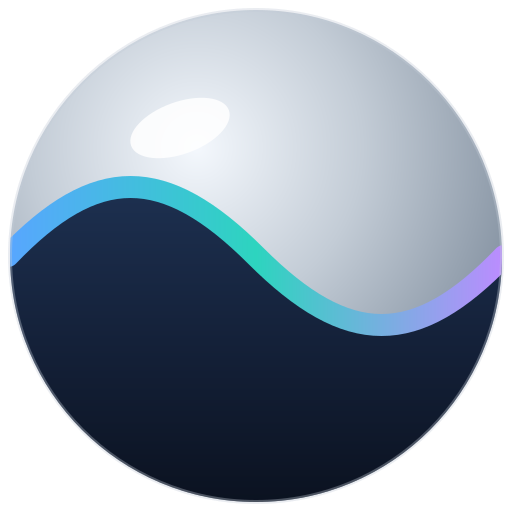
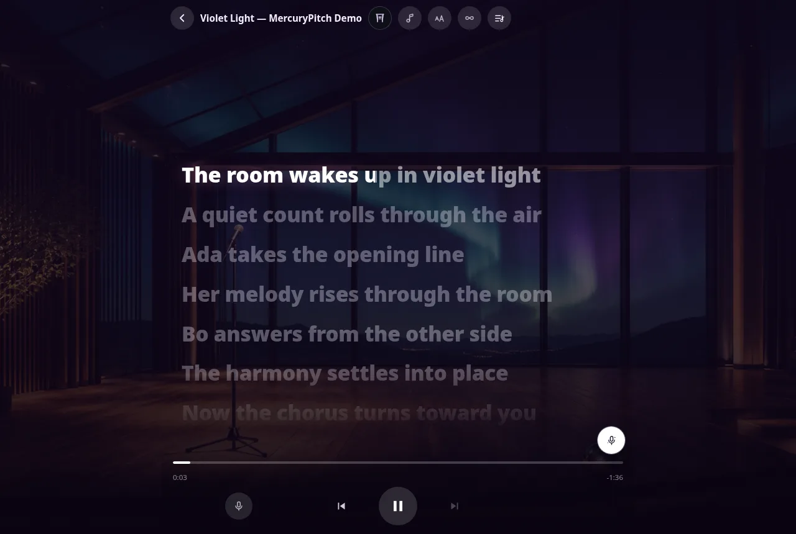
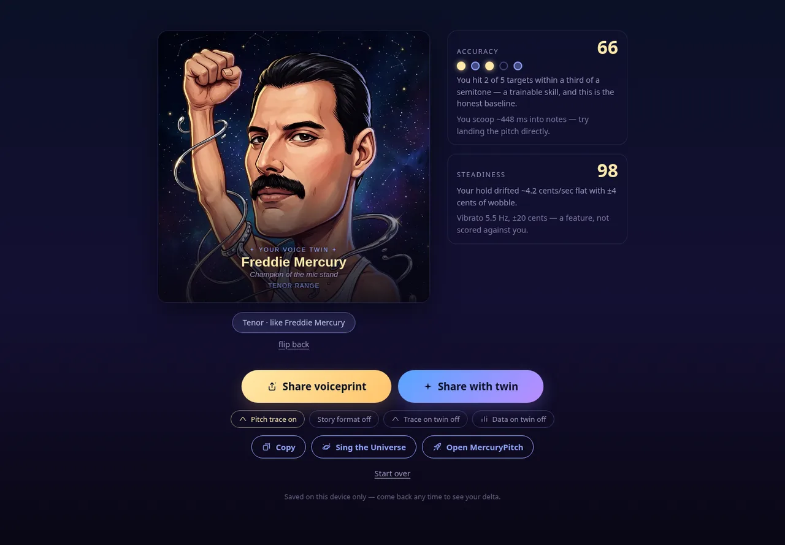
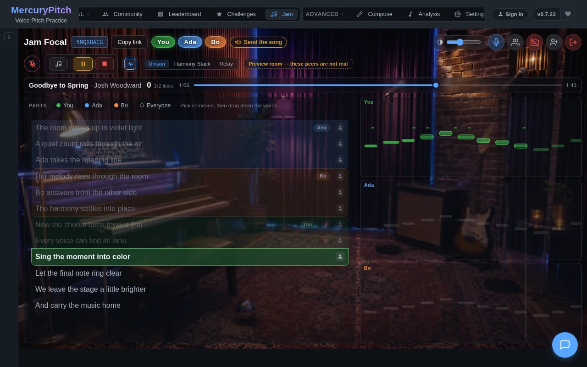
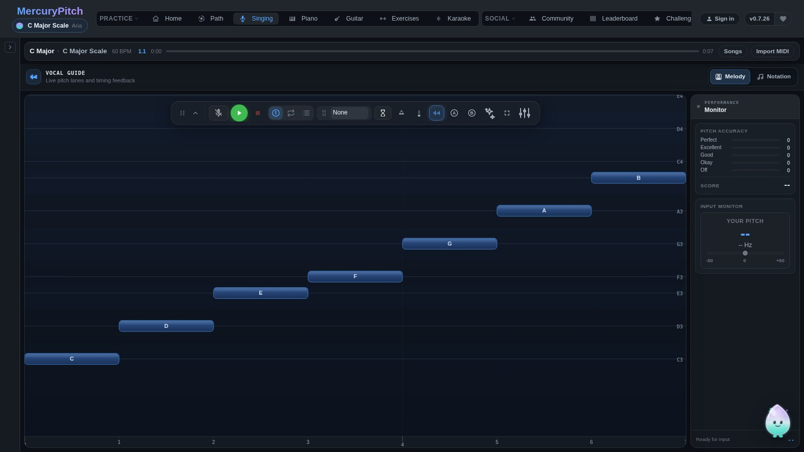
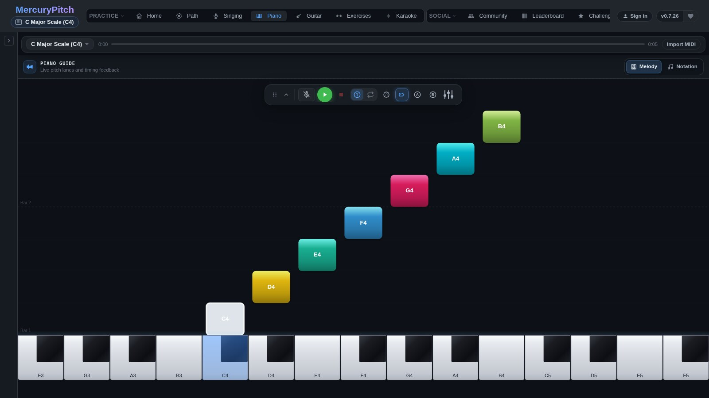

<p align="center">
  
</p>

<h1 align="center">MercuryPitch</h1>

<p align="center">
  <strong>See your voice. Sing your songs. Share the room.</strong><br />
  A free, open-source singing studio for the browser, with Karaoke Night,
  playful voice mirrors, live Jam Rooms, and private on-device pitch feedback.
</p>

<p align="center">
  <a href="https://mercurypitch.com/"><strong>Launch the app</strong></a>
  ·
  <a href="https://mercurypitch.com/karaoke-night">Karaoke Night</a>
  ·
  <a href="https://mercurypitch.com/mirror">Voice Mirror</a>
  ·
  <a href="https://mercurypitch.com/glass">Glass</a>
  ·
  <a href="https://mercurypitch.com/#/jam">Jam Rooms</a>
  ·
  <a href="https://about.mercurypitch.com/voice-legends/">Voice Legends</a>
  ·
  <a href="https://about.mercurypitch.com/">Explore the website</a>
</p>

<a href="https://mercurypitch.com/karaoke-night">
  
</a>

Karaoke Night turns a song into a focused performance: timed lyrics, live pitch
cues, vocal and instrumental controls, and a calm full-screen Zen stage when it
is time to sing.

## Sing your way

- **Karaoke Night** — follow the words and pitch, shape the mix, and step into a distraction-free stage.
- **Voice Mirror** — turn three short vocal tasks into a visual profile of your range, accuracy, steadiness, and voice twin.
- **Glass** — sing toward a resonant note, hear your takes back, and build enough resonance to shatter the mirror.
- **Jam Rooms** — invite singers, divide the lyrics, share playback controls, and follow each part on its own pitch lane.
- **Practice Studio** — train voice, piano, or guitar against editable notes, exercises, and live feedback.
- **Karaoke creation** — separate stems, align lyrics, and turn songs into focused practice sessions.

## Meet your voice

<a href="https://mercurypitch.com/mirror">
  
</a>

Voice Mirror makes the shape of your singing readable and shareable. See how
your range and steadiness compare with a voice legend, then explore the wider
[Voice Legends constellation](https://about.mercurypitch.com/voice-legends/).
Glass turns your own voice into the challenge: land the note, hold the
resonance, replay the take, and try again.

[Try Voice Mirror](https://mercurypitch.com/mirror) ·
[Break Glass with your voice](https://mercurypitch.com/glass)

## Share the room

<a href="https://mercurypitch.com/#/jam">
  
</a>

Create a room, invite singers, divide the lyrics, and keep the performance
moving with shared host controls. Every singer can follow their own pitch lane,
and a host-selected room scene sets the mood for everyone.

## Build the next note



Singing Practice pairs editable melody targets with live pitch and timing
feedback, loops, a metronome, and a focused performance monitor.



Voice, piano, and guitar practice share the same musical workspace: build an
exercise, slow down a difficult passage, loop it, and keep the result.

## Free, private, and open

Core singing, practice, and collaboration stay free. Detailed pitch analysis
runs on your device, and MercuryPitch does not retain microphone audio by
default. Accounts, sharing, Jam signalling, and optional cloud stem separation
are used only when you choose those features.

Supporter editions add optional cosmetic Karaoke stages and Jam Room scenes as
they are released. When a host selects a Jam scene, everyone in the room can
enjoy it; the singing tools never sit behind that cosmetic layer.

## Run locally

Requires Node.js 22+ and pnpm.

```bash
git clone https://github.com/mercurypitch/mercurypitch.git
cd mercurypitch
pnpm install
pnpm dev
```

MercuryPitch opens at `https://localhost:3000`.

---

<p align="center">
  <a href="https://github.com/mercurypitch/mercurypitch/issues/new">Report an issue</a>
  ·
  <a href="CONTRIBUTORS.md">Contributors</a>
  ·
  <a href="https://mercurypitch.com/#/settings/credits">Support MercuryPitch</a>
  ·
  <a href="LICENSE">AGPL-3.0</a>
</p>
