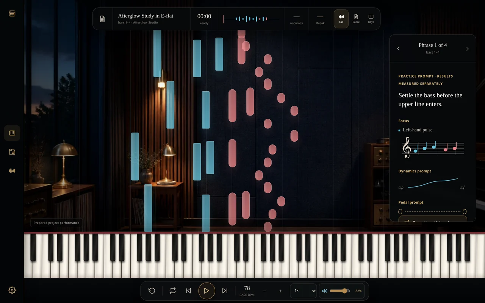
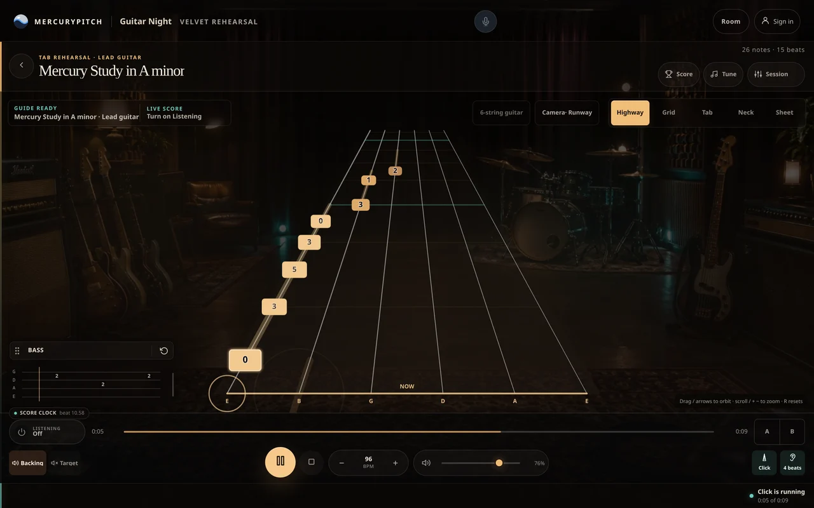

<p align="center">
  
</p>

<h1 align="center">MercuryPitch</h1>

<p align="center">
  <strong>See your voice. Sing your songs. Share the room.</strong><br />
  A free, open-source music studio for the browser, with Karaoke Night, rooms
  for piano and guitar, live Jam Rooms, and private on-device pitch feedback.
</p>

<p align="center">
  <a href="https://mercurypitch.com/"><strong>Launch the app</strong></a>
  ·
  <a href="https://mercurypitch.com/karaoke-night">Karaoke Night</a>
  ·
  <a href="https://mercurypitch.com/piano-night">Piano Night</a>
  ·
  <a href="https://mercurypitch.com/guitar-night">Guitar Night</a>
  ·
  <a href="https://mercurypitch.com/ear-lab">Ear Lab</a>
  ·
  <a href="https://mercurypitch.com/mirror">Voice Mirror</a>
  ·
  <a href="https://mercurypitch.com/glass">Glass</a>
  ·
  <a href="https://mercurypitch.com/#/jam">Jam Rooms</a>
  ·
  <a href="https://about.mercurypitch.com/voice-legends/">Voice Legends</a>
  ·
  <a href="https://about.mercurypitch.com/">Explore the website</a>
</p>

<a href="https://mercurypitch.com/karaoke-night">
  
</a>

Karaoke Night turns a song into a focused performance: timed lyrics, live pitch
cues, vocal and instrumental controls, and a calm full-screen Zen stage when it
is time to sing.

## Sing your way

- **Karaoke Night** — follow the words and pitch, shape the mix, and step into a distraction-free stage.
- **Piano Night** — a study on the stand, notes falling toward a full keyboard, and a coach that frames one phrase at a time.
- **Guitar Night** — a tab that becomes a highway, a tuner preflight, and live listening on every string.
- **Voice Mirror** — turn three short vocal tasks into a visual profile of your range, accuracy, steadiness, and voice twin.
- **Glass** — sing toward a resonant note, hear your takes back, and build enough resonance to shatter the mirror.
- **Jam Rooms** — invite singers, divide the lyrics, share playback controls, and follow each part on its own pitch lane.
- **Practice Studio** — train voice, piano, or guitar against editable notes, exercises, and live feedback.
- **Karaoke creation** — separate stems, align lyrics, and turn songs into focused practice sessions.

## Meet your voice

<a href="https://mercurypitch.com/mirror">
  
</a>

Voice Mirror makes the shape of your singing readable and shareable. See how
your range and steadiness compare with a voice legend, then explore the wider
[Voice Legends constellation](https://about.mercurypitch.com/voice-legends/).
Glass turns your own voice into the challenge: land the note, hold the
resonance, replay the take, and try again.

[Try Voice Mirror](https://mercurypitch.com/mirror) ·
[Break Glass with your voice](https://mercurypitch.com/glass)

## Share the room

<a href="https://mercurypitch.com/#/jam">
  
</a>

Create a room, invite singers, divide the lyrics, and keep the performance
moving with shared host controls. Every singer can follow their own pitch lane,
and a host-selected room scene sets the mood for everyone.

## Bring your own instrument

<a href="https://mercurypitch.com/piano-night">
  
</a>

Piano Night puts a study on the stand and streams its notes down to a full
keyboard. Read the same passage as falling notes, as a staff, or as hands on
the keys; the coach frames one phrase at a time with its own focus, dynamics,
and pedal prompt. Import a MIDI file and pick the track you are learning — the
rest plays underneath while one lane is measured.

<a href="https://mercurypitch.com/guitar-night">
  
</a>

Guitar Night turns a tab into a highway: every note travels toward the string
and fret that plays it. Tune up in the room, then turn on Listening and the
room scores what it hears from your guitar. Highway, Grid, Tab, Neck, and Sheet
are five readings of the same part, and the band plays under all of them.

Voice, piano, and guitar practice also share one musical workspace in the
Practice Studio: build an exercise, slow a difficult passage down, loop it, and
keep the result.

## Free, private, and open

Core singing, practice, and collaboration stay free. Detailed pitch analysis
runs on your device, and MercuryPitch does not retain microphone audio by
default. Accounts, sharing, Jam signalling, and optional cloud stem separation
are used only when you choose those features.

Supporter editions add optional cosmetic scenes — Karaoke stages, Jam Rooms,
and the piano and guitar rooms — as they are released. When a host selects a
Jam scene, everyone in the room can enjoy it; the playing and singing tools
never sit behind that cosmetic layer.

## Run locally

Requires Node.js 22+ and pnpm.

```bash
git clone https://github.com/mercurypitch/mercurypitch.git
cd mercurypitch
pnpm install
pnpm dev
```

MercuryPitch opens at `https://localhost:3000`.

## Contributing without heavy local gates

Install the repository's lightweight Git hooks once per clone:

```bash
git config core.hooksPath .githooks
```

The commit hook only checks staged whitespace, and the push hook blocks direct
pushes to `main`. Neither runs a formatter, linter, typechecker, or test suite.

During a work item, run tests focused on the code being changed. Once, before
the first PR push, prepare the complete branch diff and run its relevant
typecheck:

```bash
pnpm pr:prepare
pnpm typecheck
```

Use `pnpm beside-cue:typecheck`, `pnpm typecheck:db`, or
`pnpm typecheck:jam` when one of those workspaces is the change's scope. CI is
the authoritative full gate after the PR opens, so later commits should run
only the command needed for the change or a reported failure. See
[AGENTS.md](AGENTS.md) for the complete check matrix and
[docs/claude/CLAUDE.md](docs/claude/CLAUDE.md) for hook details.

---

<p align="center">
  <a href="https://github.com/mercurypitch/mercurypitch/issues/new">Report an issue</a>
  ·
  <a href="CONTRIBUTORS.md">Contributors</a>
  ·
  <a href="https://mercurypitch.com/#/settings/credits">Support MercuryPitch</a>
  ·
  <a href="LICENSE">AGPL-3.0</a>
</p>
