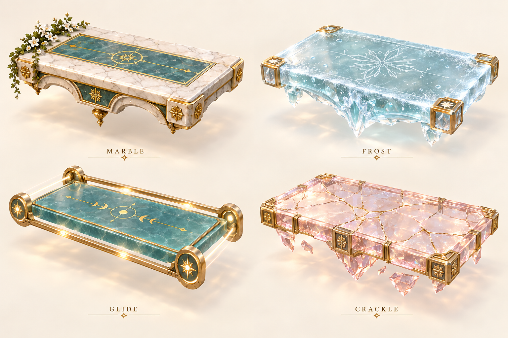
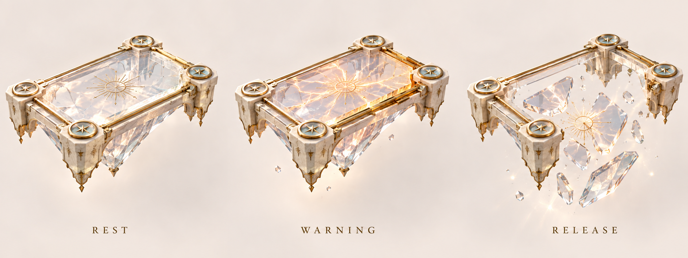

# Cloudway Trial — visual audition

**Concept only.** These are built-in ChatGPT image-generation prototypes for owner
review, not screenshots, modeled game assets or implemented physics. No Meshy jobs
have been submitted for this mode. Exact prompts, original PNGs and their hashes
are in `concepts/`.

## Reusable platform family

Recommend warm marble as the rest surface, icy translucent slabs for momentum,
celadon rafts for travel, and framed rose-clear glass for the timed warning tile.
The landing surface must stay wide and uncluttered. Gold/flower trim is secondary
to readable edges. Model rails as a world motion guide rather than wheels.

## Route between islands

A safe singing perch leads toward a small sequence of broad platforms, another
rest point and an upright portrait finale. This is a material/composition study;
jump distances are not measured and will be set from the actual Merc controller.
The actual silver droplet rig remains the character source; imagegen does not
replace its mesh or animations.

## Crackle warning and release

The framed state-sheet variant is the recommended production form. Apply the
family-sheet rose tint as a material variant after approval. The warned intact
surface and falling fragments must share an exact source mesh and collision
footprint. Keep the remaining rim non-walkable after release, or explicitly author
it as support; do not leave an invisible solid rectangle after collapse.

## Decisions before production

1. Approve or revise the platform family and overall material direction.
2. Choose the first placement: optional map side-route recommended; a Legend trial
   can follow after controls and microphone timing are playtested.
3. Approve the separation of beginner traversal and safe singing, with combined
   timed-voice hazards reserved for an explicitly introduced advanced segment.

Detailed proposal: [Cloudway Trials](../../plans/CLOUDWAY-PLATFORM-TRIALS.md).
Related reward proposal: [replay difficulty and stars](../../plans/REPLAY-DIFFICULTY-AND-LEVEL-STARS.md).
